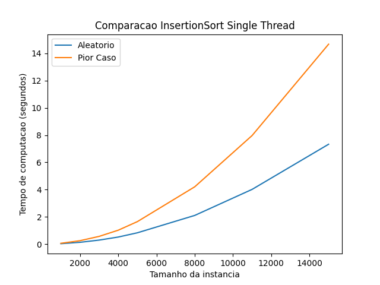
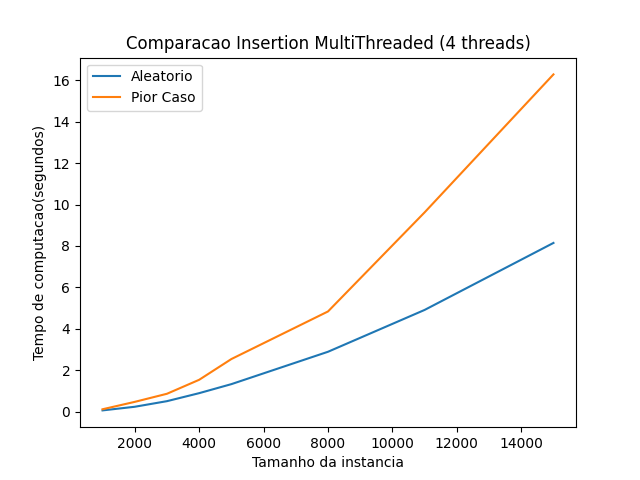

# Insertion sort test

in [Insertion.py](./Insertion.py) there's a Bubble sort implementation.

in [Test.py](./Test.py) there's a script for a perfomance test.

here's a example of the test's result:

