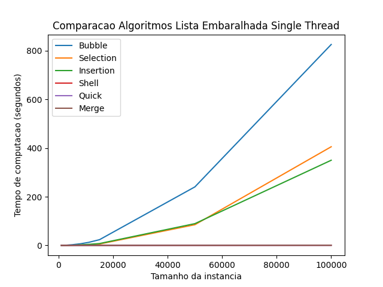

# Search and sort algorithms

this repository is a place that i'll put some sort algorithms implemented with python 3

# Installing

## Ubuntu 20.04
1. instalar o python 3
2. instalar o virtualenv e iniciar ambiente virtual
```
sudo apt install virtualenv

virtualenv -p python3 .env

source .env/bin/activate
```
3. instalar dependencias do python
```
pip install -r requirements.txt
```

# Algorithms

|                          Algorithms                                             |
| --------------------------------------------------------------------- |
| [Bubble Sort](./Bubble) |
| [Selection Sort](./Selection) |
| [Insertion Sort](./Insertion) |
| [Shell Sort](./Shell) |
| [Quick Sort](./Quick) |

# Comparing the algorithms

[Main.py](./Main.py) has a script for comparing the algorithms. It will produce some images
like these:

.png)
.png)
