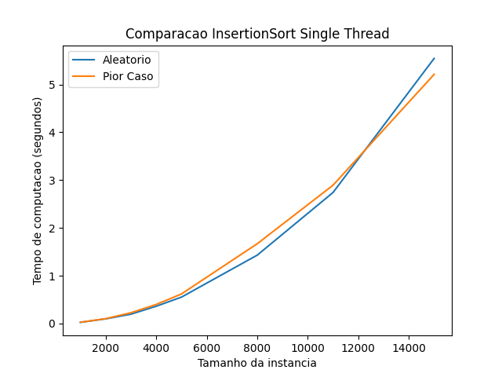
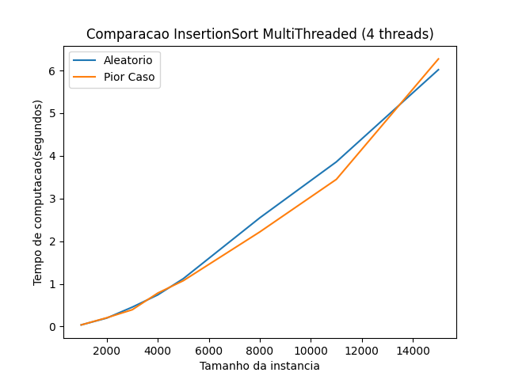

# Selection sort test

in [Selection.py](./Selection.py) there's a Selection sort implementation.

in [Test.py](./Test.py) there's a script for a perfomance test.

here's a example of the test's result:

